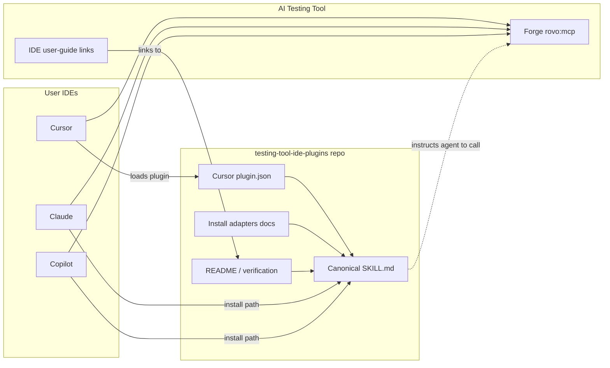

# Testing Tool IDE Plugins Architecture

## Introduction

This document describes the architecture for the public **Testing Tool IDE Plugins** pack that extends **AI Testing Tool**: Agent Skills, a Cursor plugin, and Claude/Copilot install adapters. It guides implementation and integration with AI Testing Tool IDE documentation and the **[Atlassian Rovo MCP Server](https://support.atlassian.com/atlassian-ai-gateway/docs/get-started-with-the-atlassian-remote-mcp-server/)** (IDE connection). Product-specific tools may also be exposed into that MCP session when available.

**Relationship to existing architecture:**  
This pack adds no Forge modules, product APIs, or data stores. Product user-guide pages own human MCP setup; this pack owns agent behavior instructions.

### Existing project analysis

#### Current project state

- **Primary purpose:** AI Testing Tool provides test management in Jira. IDE integrations (Cursor, GitHub Copilot, Claude) document MCP-based TestCase and report workflows. Settings → Active is preference-only and does not register MCP.
- **Current tech stack:** Forge application; markdown user guide; Agent Skills (`SKILL.md`); Cursor `.cursor-plugin` packaging conventions.
- **Architecture style:** Content and plugin packaging; MCP is an external IDE-connected runtime.
- **Deployment method:** Public GitHub repository; Cursor local plugin install; Claude/Copilot skill-path install; links from product IDE docs.

#### Available documentation

- Pack PRD (`docs/prd.md`)
- AI Testing Tool IDE user-guide pages (Cursor / Copilot / Claude hub)
- [Atlassian Rovo MCP Server](https://support.atlassian.com/atlassian-ai-gateway/docs/get-started-with-the-atlassian-remote-mcp-server/) get-started guide
- Agent Skills and Cursor plugin conventions

#### Identified constraints

- Discover MCP tools at runtime; do not invent tool names
- Single canonical skill body across tools
- No secrets or private credentials in the public repository
- Skills must degrade clearly when MCP tools are unavailable
- Product docs own human MCP setup; pack owns agent workflows
- Public repository: https://github.com/ai-testing-tool/testing-tool-ide-plugins

### Change log

| Change | Date | Version | Description | Author |
| ------ | ---- | ------- | ----------- | ------ |
| Initial draft | 2026-09-09 | 0.1 | Architecture kickoff from PRD | Product |
| Complete draft | 2026-09-09 | 1.0 | Full sections through security, validation, handoffs | Product |
| Wording polish | 2026-09-09 | 1.1 | Public-document wording cleanup | Product |
| Atlassian MCP | 2026-09-09 | 1.2 | IDE connection = Atlassian Rovo MCP Server | Product |

## Enhancement scope and integration strategy

### Enhancement overview

**Enhancement type:** Public distribution pack (Agent Skills + Cursor plugin + install adapters)  
**Scope:** Canonical `testing-tool-mcp` skill; Cursor `.cursor-plugin`; Claude and Copilot install adapters; links from AI Testing Tool IDE user-guide pages; README, install, and verification docs. No Forge code, APIs, or databases in this pack.  
**Integration impact:** Low on the Forge runtime; medium on docs discoverability; high on IDE install and agent UX.

### Integration approach

**Code integration:** Publish-only pack at https://github.com/ai-testing-tool/testing-tool-ide-plugins. The product app does not import pack code. Integration is (1) documentation links and (2) the user’s IDE connecting to AI Testing Tool `rovo:mcp`.

**Database integration:** None.

**API integration:** None owned by the pack. Agents call AI Testing Tool MCP tools discovered in the IDE after the user configures the MCP server.

**UI integration:** None in-product. Install experience is README and `docs/install/*`. Optional later: Cursor marketplace listing.

### Compatibility requirements

- **MCP compatibility:** Do not assume fixed MCP tool names beyond discovery; work with whatever tools the live `rovo:mcp` module exposes.
- **Database schema:** N/A.
- **Docs consistency:** Align wording with AI Testing Tool IDE FAQs (Active is not MCP registration; prefer Rovo for in-Jira chat).
- **Performance:** Negligible for static content. Keep `SKILL.md` concise to limit agent context cost.

## Tech stack

### Existing technology stack

| Category | Current technology | Version | Usage in this pack | Notes |
| -------- | ------------------ | ------- | ------------------ | ----- |
| Product runtime | Atlassian Rovo MCP + AI Testing Tool on Jira | As deployed | External dependency only | IDE connects via `https://mcp.atlassian.com/v2/mcp` |
| Docs | Markdown user guide | — | Epic 3 links to public pack | Human MCP setup stays in product docs |
| Agent skills | Agent Skills (`SKILL.md` + frontmatter) | Open standard | Canonical skill body | Shared by Cursor, Claude, Copilot |
| Cursor packaging | `.cursor-plugin/plugin.json` | Cursor plugin format | Epic 2 | `skills` → `./skills/` |
| Claude install | `.claude/skills/` (or skill upload) | Per Claude docs | Epic 3 adapter | Same skill content |
| Copilot install | `.github/skills/` | Per Copilot Agent Skills | Epic 3 adapter | Same skill content |
| SCM / publish | GitHub | — | Public repo | https://github.com/ai-testing-tool/testing-tool-ide-plugins |
| License | MIT (default) | — | Root `LICENSE` | Unless a different OSI-approved license is required |

### New technology additions

None required for MVP. Optional later: lightweight CI to validate `SKILL.md` frontmatter.

## Data models and schema changes

**No database or persistent schema changes.** This pack stores no product data.

### Logical content artifacts

| Artifact | Purpose | Integration |
| -------- | ------- | ----------- |
| `skills/testing-tool-mcp/SKILL.md` | Canonical agent instructions + frontmatter | Loaded by Cursor, Claude, and Copilot |
| Optional `skills/testing-tool-mcp/references/*` | Progressive disclosure | Linked one level from `SKILL.md` |
| `.cursor-plugin/plugin.json` | Cursor plugin metadata | Points `skills` at the canonical folder |
| Install / verification markdown | Human install + smoke checklist | Docs only |

### Schema integration strategy

**Database changes:** None.

**Compatibility:** Skill frontmatter must remain valid Agent Skills metadata so IDE skill loaders keep working.

## Component architecture

### Components

#### Canonical skill (`testing-tool-mcp`)

**Responsibility:** Agent instructions for discover → TestCase create/update/query → report inspect; confirm-before-write; Active is not MCP; Rovo vs IDE.  
**Integration points:** Loaded by Cursor (via plugin), Claude, and Copilot skill loaders.

**Key interfaces:**
- Agent Skills frontmatter (`name`, `description`)
- Markdown workflow body; optional `references/`

**Dependencies:**
- **Existing:** AI Testing Tool MCP tools (runtime)
- **New:** None

**Technology:** Markdown + YAML frontmatter

#### Cursor plugin package

**Responsibility:** Expose canonical `skills/` to Cursor via `.cursor-plugin/plugin.json`.  
**Integration points:** Cursor local install (marketplace optional later).

**Key interfaces:**
- `plugin.json` `skills` path → `./skills/` (no forked copy)

**Dependencies:**
- **Existing:** Cursor plugin loader
- **New:** Canonical skill

**Technology:** JSON metadata

#### Install adapters (Claude / Copilot)

**Responsibility:** Document how to install the same skill into `.claude/skills/` and `.github/skills/`.  
**Integration points:** User or project skill directories.

**Key interfaces:**
- Install docs; optional copy or symlink from the canonical folder

**Dependencies:**
- **Existing:** None
- **New:** Canonical skill

**Technology:** Markdown

#### Product doc link surface

**Responsibility:** Point AI Testing Tool IDE user-guide pages at the public pack.  
**Integration points:** Hub and Cursor / Copilot / Claude pages.

**Key interfaces:**
- Markdown links to https://github.com/ai-testing-tool/testing-tool-ide-plugins

**Dependencies:**
- **Existing:** AI Testing Tool user-guide tree
- **New:** Public pack README

**Technology:** Markdown (lives in product docs, not the public pack)

### Component interaction diagram



## API design and integration

Not applicable—this pack does not add or change product HTTP APIs.

## External integration: Atlassian Rovo MCP (and AI Testing Tool tools)

- **Purpose:** IDE agents call Atlassian (and, when exposed, AI Testing Tool) tools to work with TestCases and related Jira context
- **Client setup:** [Atlassian Rovo MCP Server](https://support.atlassian.com/atlassian-ai-gateway/docs/get-started-with-the-atlassian-remote-mcp-server/) — typically `https://mcp.atlassian.com/v2/mcp`
- **Documentation:** Atlassian get-started guide; AI Testing Tool IDE user-guide pages
- **Base URL / auth:** Atlassian OAuth (or API token options per Atlassian docs); not stored in this pack
- **Integration method:** User registers Atlassian Rovo MCP in Cursor / Claude / Copilot; skill instructs agents to discover tools and prefer AI Testing Tool–specific tools when present
- **Tools used:** Whatever the live MCP session exposes (discovered at runtime—do not hardcode invented names)
- **Error handling:** If tools are not callable or TestCase design tools are missing, the skill requires clear user guidance (Active is not MCP; reconnect Atlassian MCP; product tools may still be pending)

## Source tree

### Current structure

```plaintext
testing-tool-ide-plugins/          # public repo root
└── docs/
    ├── prd.md
    └── architecture.md
```

### Target structure

```plaintext
testing-tool-ide-plugins/
├── LICENSE
├── README.md
├── .cursor-plugin/
│   └── plugin.json                 # skills → ./skills/
├── skills/
│   └── testing-tool-mcp/
│       ├── SKILL.md                # canonical skill (single source of truth)
│       └── references/             # optional progressive disclosure
├── docs/
│   ├── prd.md
│   ├── architecture.md
│   ├── verification.md
│   └── install/
│       ├── cursor.md
│       ├── claude.md
│       └── github-copilot.md
```

**Adapter strategy:** Do not check in duplicate skill trees under `.claude/` or `.github/` in this repo. Install docs instruct copy or symlink of `skills/testing-tool-mcp` into the consumer project’s skill path.

### Integration guidelines

- **File naming:** kebab-case skill folder `testing-tool-mcp`; `SKILL.md` per Agent Skills convention; install docs `cursor.md`, `claude.md`, `github-copilot.md`
- **Folder organization:** Canonical content under `skills/`; Cursor-only metadata under `.cursor-plugin/`; human docs under `docs/`
- **Plugin pathing:** `plugin.json` uses a relative `skills` path only

## Infrastructure and deployment

### Existing infrastructure

**Current deployment:** AI Testing Tool Forge app is deployed independently; MCP availability depends on that deployment. This pack is not part of Forge deploy.  
**Tools:** GitHub for the public pack; IDE skill and plugin loaders on the client.  
**Environments:** Public GitHub `main` (and tags or releases as needed). No separate staging app for the pack.

### Deployment strategy

1. Develop and review content in git.
2. Push to https://github.com/ai-testing-tool/testing-tool-ide-plugins (`main`).
3. Users install from GitHub (clone, copy, or Cursor local plugin symlink).
4. Separately: update AI Testing Tool IDE user-guide pages to link to the pack when the README is ready.

**Infrastructure changes:** None for Forge or cloud. Optional later: GitHub Actions to lint `SKILL.md` frontmatter.

**CI:** Not required for MVP. Product doc updates follow the existing docs contribution process.

### Rollback

**Method:** Git revert or restore a previous `main` commit or tag. Product doc links can be reverted independently.  
**Risk mitigation:** The pack cannot break Forge runtime; worst case is poor agent instructions—fix forward or revert skill content.  
**Monitoring:** Manual smoke checklist (`docs/verification.md`); GitHub issues on the public repo.

## Coding standards

### Baseline

**Style:** Markdown, YAML frontmatter, and JSON only—no application code in this pack.  
**Linting:** Optional later frontmatter checks.  
**Testing:** Manual agent smoke via `docs/verification.md`.  
**Docs tone:** Match AI Testing Tool IDE user-guide FAQs (Active is not MCP; Rovo for in-Jira). Clear, short sentences; no secrets.

### Pack-specific standards

- **Single source of truth:** Edit only `skills/testing-tool-mcp/`; never maintain divergent copies for Claude or Copilot in this repo.
- **Skill frontmatter:** Required `name` (kebab-case) and third-person `description` with what and when; stay within Agent Skills length limits.
- **Skill body:** Under about 500 lines; progressive disclosure via one-level `references/`; discover MCP tools at runtime.
- **Safety language:** Confirm-before-write; explicit confirm for delete; state that delete is destructive.
- **plugin.json:** Valid JSON; `skills` points at `./skills/`; license field set; description mentions AI Testing Tool MCP and TestCases.
- **Public hygiene:** No internal development paths, credentials, or customer site URLs.

### Critical integration rules

- Instruct agents to discover MCP tools; do not hardcode tool identifiers that may change.
- Document the “tools not callable” path; never fail silently.
- Record verification results in `docs/verification.md`.

## Testing strategy

### Relationship to product tests

AI Testing Tool app tests do not cover this pack. MVP verification is the pack-local checklist in `docs/verification.md`, aligned with PRD success metrics.

### Requirements

**Automated unit tests:** None required for MVP.

**Integration / smoke:**
- Manual agent runs in Cursor (plugin), plus at least one of Claude or Copilot
- Confirm MCP still works without the pack; pack absence must not affect Forge
- Exercise README example prompts; observe confirm-before-write; require explicit confirm for delete

**Regression:**
- After skill edits, re-run connected and disconnected smokes
- Record pass/fail and date in `docs/verification.md`

## Security

### Existing measures

Authentication and authorization are owned by AI Testing Tool Forge and the user’s IDE MCP session. Product data stays in AI Testing Tool / Jira. This pack ships no customer data.

### Requirements for this pack

- Never commit secrets or private credentials.
- Require confirm-before-write and explicit delete confirmation in the skill.
- Do not instruct agents to bypass product permissions or invent privileged APIs.
- Use an OSI-approved public license (MIT default).

### Security checks

Pre-publish review for leaked secrets; smoke that delete asks for confirmation. Penetration testing is not required for markdown and plugin metadata MVP.

## Validation summary

**Project type:** Content and plugin pack (no product UI screens; no pack-owned HTTP APIs).

| Category | Status | Notes |
| -------- | ------ | ----- |
| Requirements alignment | Pass | PRD functional and non-functional requirements covered |
| Architecture clarity | Pass | Components, diagram, and source tree defined |
| Separation of concerns | Pass | Skill vs Cursor metadata vs install docs vs product docs vs MCP |
| Tech stack | Pass | Conventions only; no new runtimes |
| Data / schema | N/A | No database |
| Source tree and deploy | Pass | Public GitHub; git-based rollback |
| Coding standards | Pass | Skill and public-doc rules |
| Testing | Pass | Manual smokes per PRD |
| Security | Pass | No secrets; confirm-before-write |

**Accepted MVP risks:** MCP tool names may change (mitigated by discovery); skill quality is the main failure mode (mitigated by verification); product doc links are a separate docs change.

**Decision:** Ready for implementation.

## Follow-on

### Story sequencing

Use `docs/architecture.md` with `docs/prd.md`. Implement Epics 1 → 2 → 3 in order. Keep a single canonical `skills/testing-tool-mcp`. Start with pack skeleton and README (1.1), then skill (1.2), then verification (1.3). Do not change Forge or `rovo:mcp` in this pack. Public repo: https://github.com/ai-testing-tool/testing-tool-ide-plugins.

### Implementation notes

Follow the source tree and coding standards above. Cursor `plugin.json` must point `skills` at `./skills/` only. Install adapters are documentation (copy or symlink)—do not duplicate `SKILL.md`. Discover MCP tools at runtime. Confirm-before-write and explicit delete confirmation are mandatory. Link AI Testing Tool IDE user-guide pages to the public repo only after the README exists. Record smokes in `docs/verification.md`.
